<!--START_SECTION:hero-->

  <a href="https://blenback.github.io/">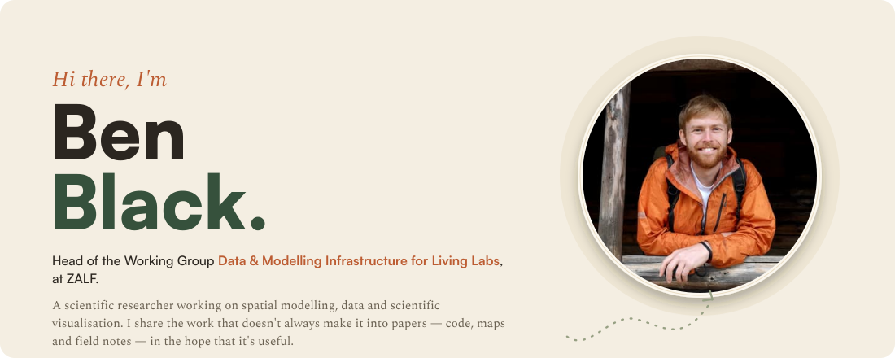</a>

  
  
  
  
  
  
  
  

<!--END_SECTION:hero-->

---

- 🔭 &nbsp;Building data and modelling infrastructure for agricultural **living labs** at [ZALF](https://www.zalf.de/en/)
- 🌍 &nbsp;Working on land use change, biodiversity and ecosystem service **scenarios under deep uncertainty**
- 🛠️ &nbsp;Mostly `R`, `Quarto` and the occasional bit of `JavaScript` — reproducible by default
- 🌱 &nbsp;Always up for talking about **Open Science**, and how to make research outputs people actually use

---

## Posts &nbsp;[all posts →](https://blenback.github.io/posts.html)

<!--START_SECTION:posts-->

  <a href="https://blenback.github.io/posts/2026-07-21-iemss-dublin.html">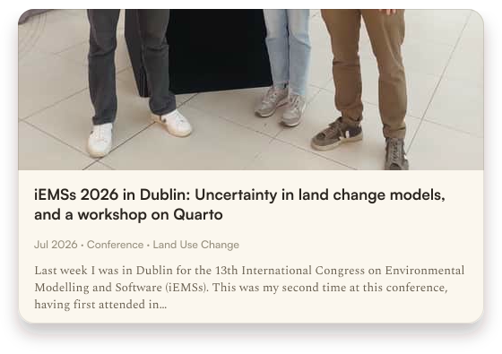</a>
  <a href="https://blenback.github.io/posts/2026-06-19-world-biodiversity-forum-wrap-up.html">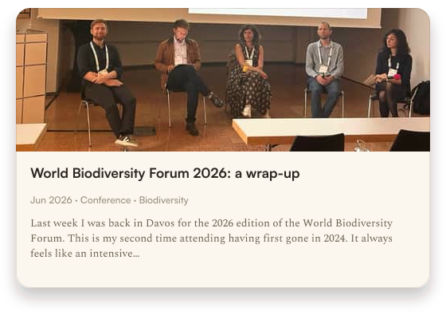</a>
  <a href="https://blenback.github.io/posts/2026-06-10-barcamp-openscience.html">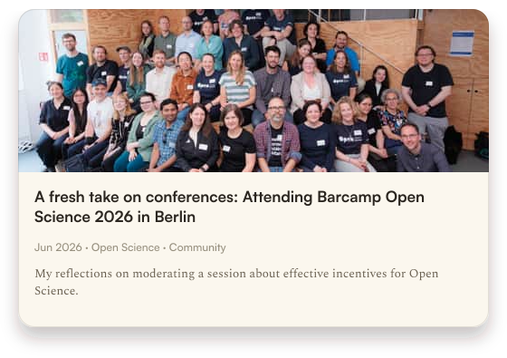</a>
  <a href="https://blenback.github.io/posts/2026-06-04-babelquarto-revealjs.html">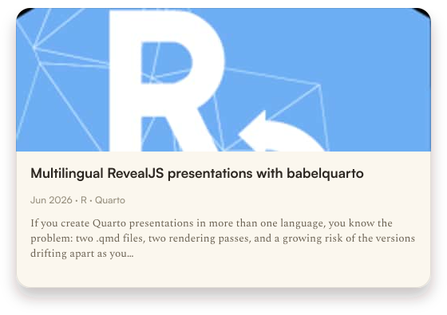</a>

<!--END_SECTION:posts-->

## Recent publications &nbsp;[all publications →](https://blenback.github.io/publications.html)

<!--START_SECTION:publications-->
<b><a href="https://doi.org/10.1093/biosci/biag010">The PAVE pathway: how to talk about models with people who did(n't) build them</a></b> 
Bell, A., Troost, C., Filatova, T., Vincenot, C., Qin, C., Fiedler, S., Lemmen, C., Lynch, I., Pierce, M., Edmonds ,B., McIntire, E., Wang, H., Koralewski, T., Grant, W., Wang, M., Black, B., Grimm, V. 
<i>Bioscience</i> &middot; 2026
 

 

<b><a href="https://doi.org/10.1007/s10113-026-02551-9">Temporal Archetypes of Nature's Contributions to People for Sustainable Landscape Development</a></b> 
Wicki, S., Black, B., Külling, N., Kurmann, M., Wang, J., Lehmann, A., Gret-Regamey, A. 
<i>Regional Environmental Change</i> &middot; 2026
 

 

<b><a href="https://doi.org/10.1016/j.jenvman.2025.128395">Identifying robust area-based conservation strategies to secure ecosystem service provision under uncertainties</a></b> 
Black, B. and Adde, A. and Külling, N. and Büth, C. and Kurmann, M. and Lehmann, A. and Altermatt, F. and Guisan, A. and Gret-Regamey, A. 
<i>Journal of Environmental Management</i> &middot; 2026
   

 

<b><a href="https://doi.org/10.1016/j.futures.2025.103751">Where will the change come from? Identifying decision-relevant factors in future Land Use and Cover Change (LUCC) scenarios to support planning under uncertainty</a></b> 
Roman, O., Adey, B., Black, B. and Zeindl, E. 
<i>Futures</i> &middot; 2025
 
<!--END_SECTION:publications-->

## Recent presentations &nbsp;[all presentations →](https://blenback.github.io/presentations.html)

<!--START_SECTION:presentations-->

  <a href="https://blenback.github.io/presentations/2026_07_15_iemss.html">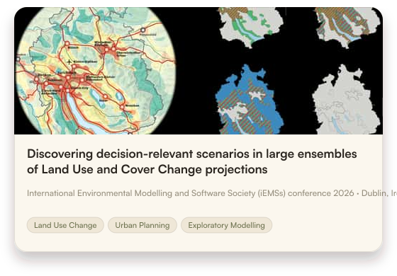</a>
  <a href="https://blenback.github.io/presentations/2026_06_16_WBF_NFF.html">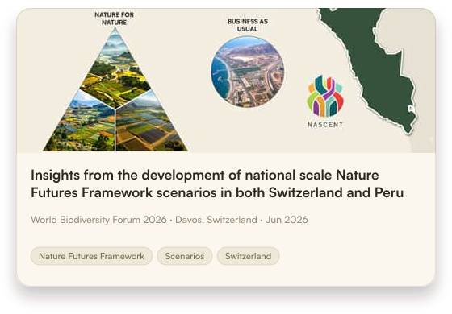</a>
  <a href="https://blenback.github.io/presentations/2026_06_16_WBF_panel.html">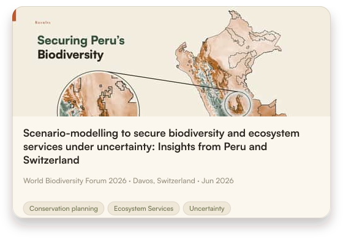</a>
  <a href="https://blenback.github.io/presentations/IMC-2025-FW.html">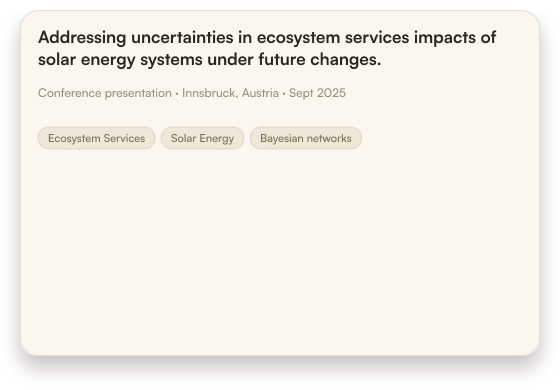</a>

<!--END_SECTION:presentations-->

## Beyond the papers &nbsp;[all outputs →](https://blenback.github.io/publications.html#beyond-the-papers)

<!--START_SECTION:outputs-->

  <a href="https://iat-dml.github.io/quarto-workshop/">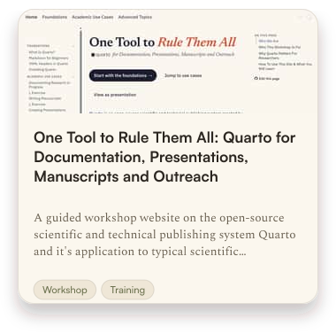</a>
  <a href="https://blenback.github.io/R-for-Reproducible-Research/">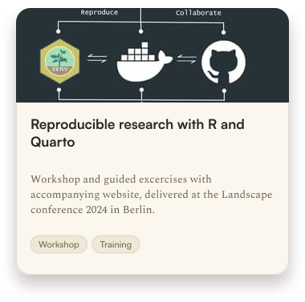</a>
  <a href="https://www.swissrefoundation.org/what-we-do/projects/Climate-solutions/Modelling-biodiversity-loss-to-boost-resilience.html">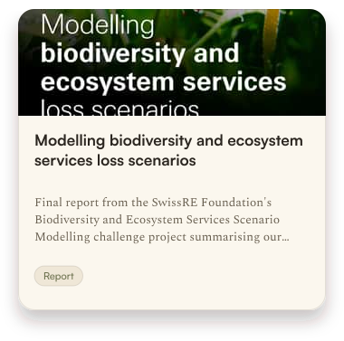</a>

<!--END_SECTION:outputs-->

---

These sections are rendered daily from <a href="https://github.com/blenback/profi">blenback/profi</a> and my <a href="https://blenback.github.io/">website feed</a> by <a href=".github/workflows/update.yml">a GitHub Action</a>.

